## ⌨️ checkbox.sh

[](https://github.com/pedro-hs/checkbox.sh/blob/master/checkbox.sh) [](https://raw.githubusercontent.com/pedro-hs/terminal-checkbox.sh/master/LICENSE.md)

Interactive checkboxes (menu) with pagination and vim keybinds for bash

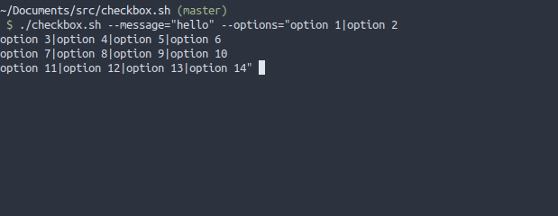

<br /><br />

### Table of Contents

- [ Features ](#features)
- [ Quick Start ](#quick-start)
- [ Promotion ](#promotion)
- [ Arguments Usage ](#arguments-usage)
- [ How to use with another script ](#how-to-use-with-another-script)
- [ Keybinds Usage ](#keybinds-usage)
- [ Limitations ](#limitations)

<br />
<br />

### Features

- Select only a option or multiple options
- Select or unselect multiple options easily
- Select all or unselect all
- Pagination
- Optional Vim keybinds
- A .sh file with approximately 500 lines
- Start with options selected
- Show selected options counter for multiple options
- Show custom message
- Show current option index and options amount
- Copy current option value to clipboard
- Help tab when press h or wrongly call the script

<br />

### Quick Start

Run the script (in bash shell) with `source checkbox.sh`

<br />

### Promotion

<strong>⭐ If you like this software, give a star ⭐</strong>

<strong>📖 Contributions are welcome 📖</strong>

<br />

### Arguments Usage

##### Checkbox options

Use the argument `--options=""`

<br />

You can add new options:

- With the character `|`
- With new line
- Mixed

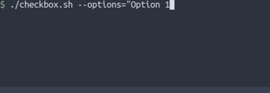

<br />

To start with options selected, put `+` before the option text (in first character)

- If the argument --multiple is missing, just the first option marked with + will start selected

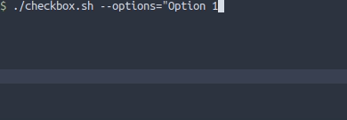

<br />

Any of this ASCII signs `\a \b \f \n \r \t` in any part of options will be removed.

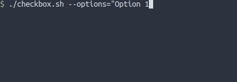

<br />

If --options"" is missing. Sample options will be loaded with 30 options.

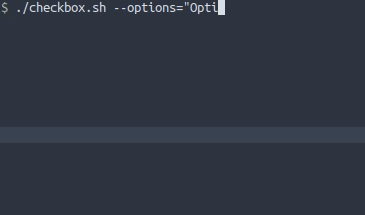

<br />

---

##### Show message on header

Use the argument `--message=""`

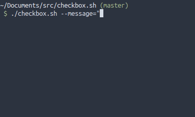

You can customize message

- Using ANSI <br />
  Example: `--message="\033[2K\033[31mhello world"`
  <br /><br />
- Using ASCII `\a \b \e \f \n \r \t \v` <br />
  Example: `--message="hello\rworld"`

- Maybe the layout breaks, in this case, try to refresh (press `r`)

<br />

---

##### Select multiple options

Use the argument `--multiple`

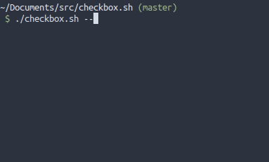

<br />

---

##### Return index instead of values

Use the argument `--index`

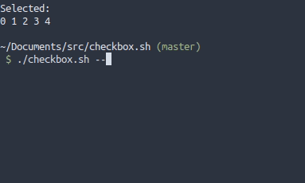

<br />
<br />

### How to use with another script

You can get the script response in the variable $checkbox_output after execute the script

- Example:

```
#!/usr/bin/env bash
source checkbox.sh --multiple --index
clear
selected_options="$checkbox_output"
echo "$selected_options"
```

- Other example: https://github.com/pedro-hs/git-selection

<br />
<br />

### Keybinds Usage

##### Move arround

Press `[UP ARROW]` or `'k'` to move cursor to option above

Press `[UP DOWN]` or `'j'` to move cursor to option below

Press `[PAGE UP]` or `'d'` to move cursor 5 options above

Press `[PAGE DOWN]` or `'u'` to move cursor 5 options below

Press `[HOME]` or `'g'` to move cursor to first option

Press `[END]` or `'G'` to move cursor to last option

<br />

---

##### Select current option

Press `[SPACE]` or `x`

<br />

##### Close and return selected options

Press `[ENTER]` or `'o'`

<br />

##### Copy current option

Press `'c'` or `'y'`

<br />

##### Select or Unselect All (only with --multiple)

Press `'a'` to select all and `'A'` to unselect all

<br />

##### Select or Unselect Mode (only with --multiple)

Press `'v'` to turn on/off select mode `'V'` to turn on/off unselect mode

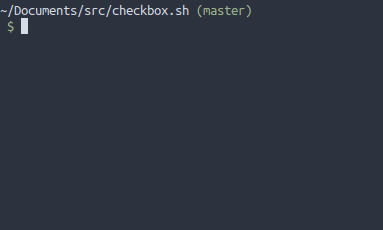

- If select mode is on. Cursor will be green and when you move up or down the options will be selected

- If unselect mode is on. Cursor will be red and when you move up or down the options will be unselected

<br />

---

##### Refresh

Press `'r'` to refresh renderization

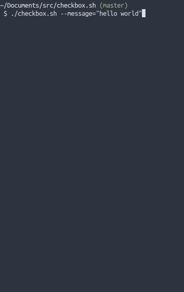

<br />

---

##### Help

Press `'h'` or call script with invalid argument, and a help page will appear

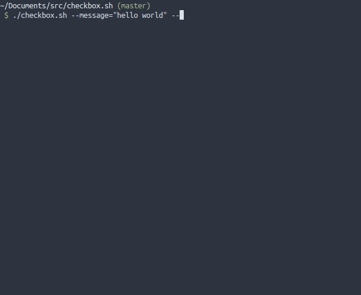

<br />
<br />

### Limitations

- Doesn't have a good compatibility with mac, I will work on this in future
- Uses bash array, so bash or similars are needed to run this script
- Terminal must have at least 8 lines for the script works. Maybe breaks in some cases with --message too. Resize terminal and press 'r'
- Don't have unit test
