### ⌨️ checkbox.sh

[](https://raw.githubusercontent.com/pedro-hs/checkbox.sh/master/checkbox.sh) [](https://raw.githubusercontent.com/pedro-hs/terminal-checkbox.sh/master/LICENSE.md)

Interactive checkboxes (menu) with pagination and vim keybinds for bash

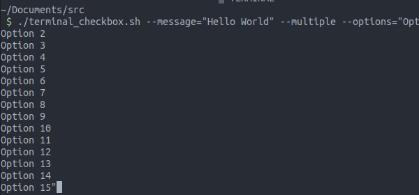

<br />

### Table of Contents

- [ Features ](#features)
- [ Arguments Usage ](#arguments-usage)
- [ Keybinds Usage ](#keybinds-usage)
- [ Limitations ](#limitations)

<br />

### Features

- Select only a option or multiple options
- Select or unselect multiple options easily
- Select all or unselect all
- Pagination
- Optional Vim keybinds
- A .sh file with approximately 500 lines
- Start with options selected
- Show selected options counter for multiple options
- Show custom message
- Show current option index and options amount
- Copy current option value to clipboard
- Help tab when press h or wrongly call the script
- Cooking: accept json from input via python script

<br />

### Arguments Usage

<br />

##### Checkbox options

Use the argument `--options=""`


You can add new options:

- With the charecter `|`<br/>
  `--options="lorem ipsum|hello world|localhost|bash|test"`

<br />

- With new line

```
--options="lorem ipsum<br />hello world<br />localhost<br />bash<br />test"
```

<br />

- Mixed

```
--options="lorem ipsum <br />hello world|localhost<br />bash|test"
```

---

To start with options selected, put `+` in first character of the option

- Example: `--options="+lorem ipsum|hello world|localhost|+bash|+test"`
- The options `lorem ipsum`, `bash` and `test` will start selected

---

Any of this ASCII signs `\a \b \c \e \f \n \r \t \v` in any part of options will be removed.

- Example: `hello w\n\c\rorld` will be `hello world`

---

If --options"" is missing. Sample options will be loaded with 30 options.

<br />

---

##### Show message on header

Use the argument `--message=""`

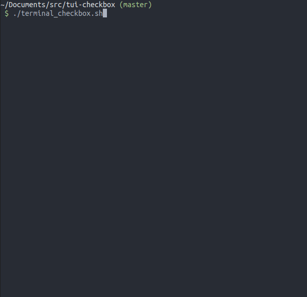

You can customize message (maybe the layout breaks):

- Using ANSI <br />
  Example: `--message="\e[2K\e[31mhello world"`
  <br /><br />
- Using ASCII `\a \b \c \e \f \n \r \t \v` <br />
  Example: `--message="hello\rworld"`

<br />

---

##### Return index instead of values

Use the argument `--index`

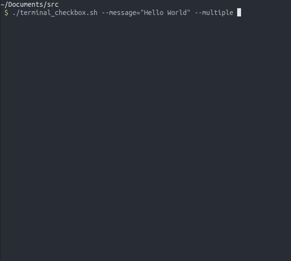

<br />

---

##### Select multiple options

Use the argument `--multiple`

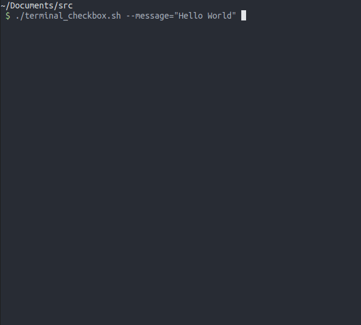

<br />

### Keybinds Usage

<br />

##### Select current option

Press `[SPACE]` or `x`

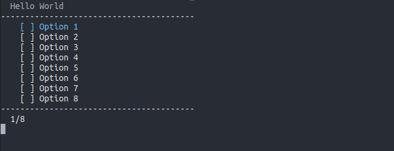

<br />

##### Close and return selected options

Press `[ENTER]` or `'o'`

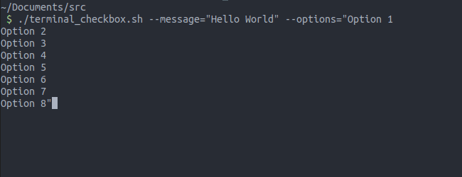

<br />

##### Quit

Press `[ESC]` or `'q'`

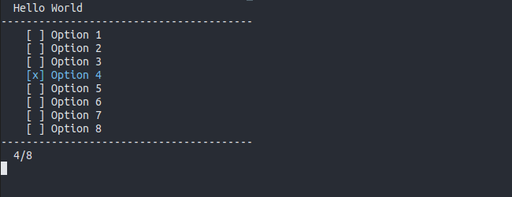

<br />

##### Move arround

Press `[UP ARROW]` or `'k'` to move cursor to option above

Press `[UP DOWN]` or `'j'` to move cursor to option below


<br />

Press `[PAGE UP]` or `'d'` to move cursor 5 options above

Press `[PAGE DOWN]` or `'u'` to move cursor 5 options below

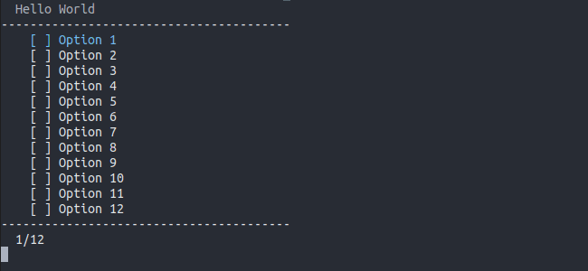

<br />

Press `[HOME]` or `'g'` to move cursor to first option

Press `[END]` or `'G'` to move cursor to last option

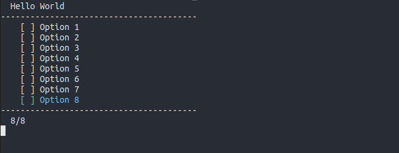

<br />

##### Copy

Press `'c'` or `'y'` to copy current option

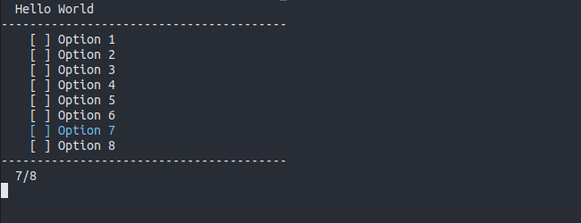

<br />

##### Refresh

Press `'r'` to refresh renderization

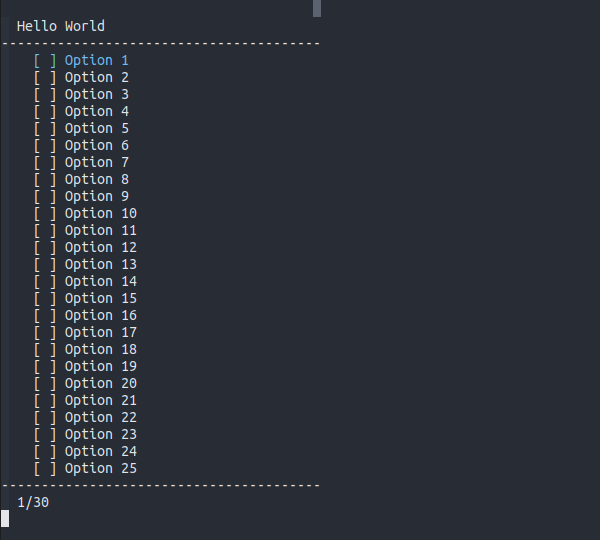

<br />

##### Help

Press `'h'` or call script with invalid argument, and a help page will appear


<br />

### Keybinds for --multiple option

<br />

##### Select or Unselect All

Press `'a'` to select all and `'A'` to unselect all

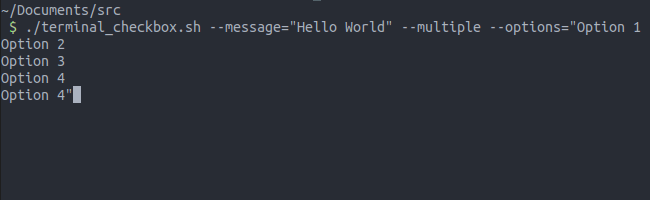

<br />

##### Select or Unselect Mode

Press `'v'` to turn on/off select mode `'V'` to turn on/off unselect mode

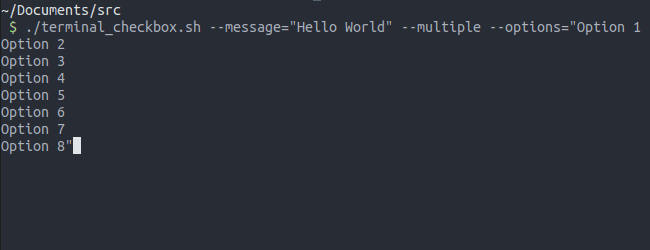

> If select mode is on. Cursor will be green and when you navigate the options will be selected

> If unselect mode is on. Cursor will be red and when you navigate the options will be unselected

<br />
<br />

## Limitations

- The script uses the command 'clear'
- The script uses bash array
- Terminal must have +8 lines for the script works
- When message has customizations like colors or line break, the script doesn't validate the terminal size well
- The script don't have any test until now
